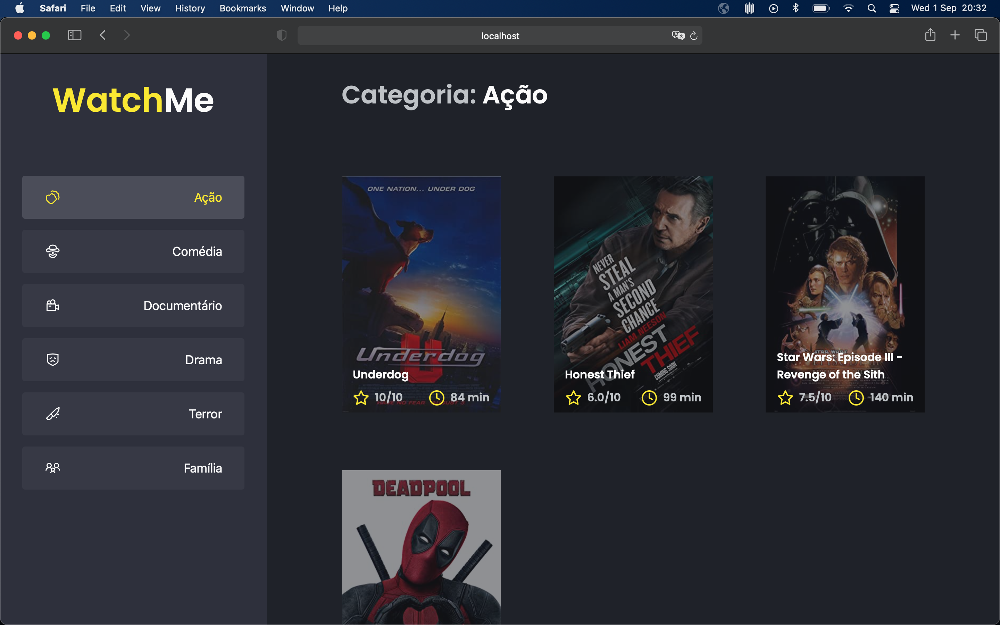

<div align="center" id="top"> 
  
</div>

<hr/>
<br>

## About

This app is a movie catalog

## Screenshots

<div align="center" id="top"> 
  
</div>

## Technologies

The following tools were used in this project:

- [React](https://pt-br.reactjs.org/)
- [ReactContextApi](https://reactjs.org/docs/context.html)
- [ReactIcons](https://react-icons.github.io/react-icons/)
- [TypeScript](https://www.typescriptlang.org/)
- [JsonServer](https://github.com/typicode/json-server)
- [Axios](https://github.com/axios/axios)
- [Sass](https://sass-lang.com/)

## Requirements

Before starting 🏁, you need to have [Git](https://git-scm.com) and [Node](https://nodejs.org/en/) installed.

## Starting

```bash
# Clone this project
$ https://github.com/marcosricardo/watch-me

# Access
$ cd watch-me

# Install dependencies
$ yarn

# Run the project
$ yarn dev

# The server will initialize in the <http://localhost:8080>
```

&#xa0;

<a href="#top">Back to top</a>
